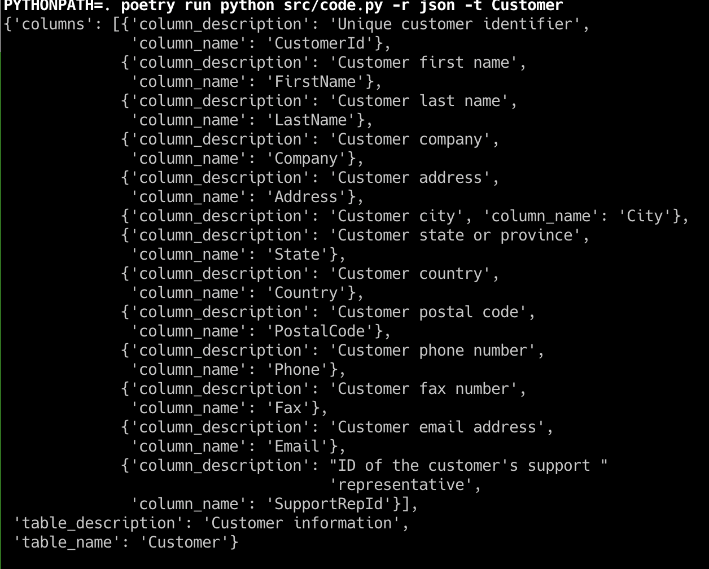
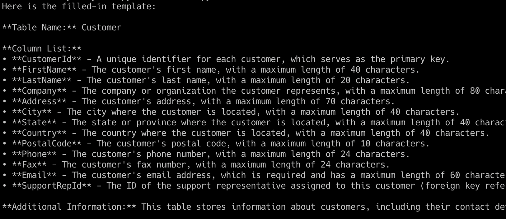

# Database

Example of using an llm along with langchain's SQLDatabase to
create a draft of a table description.

The text response can be used as a basis for building out data dictionary which
will help users of the database.

## Set Up

#### Chinook Database set up

The database used in the code is set up in a sqlite database.  The instructions on
how to set it up locally can be found at [this url](https://database.guide/2-sample-databases-sqlite/).

Also the sql script referenced in the instructions can be found under the `support` dir
with the name `chinook_sqlite.sql`.

## Running the code

You can run the `run-help` : `rye run database --help`.

There are two outputs that you can receive.   One is a text output with is a more descriptive
response about a table in the database.  The other is json output which would be useful
for an application that then makes use of the json (serialized as a dict in the python code).

## Output Examples

**JSON Response**

**Text Response**

